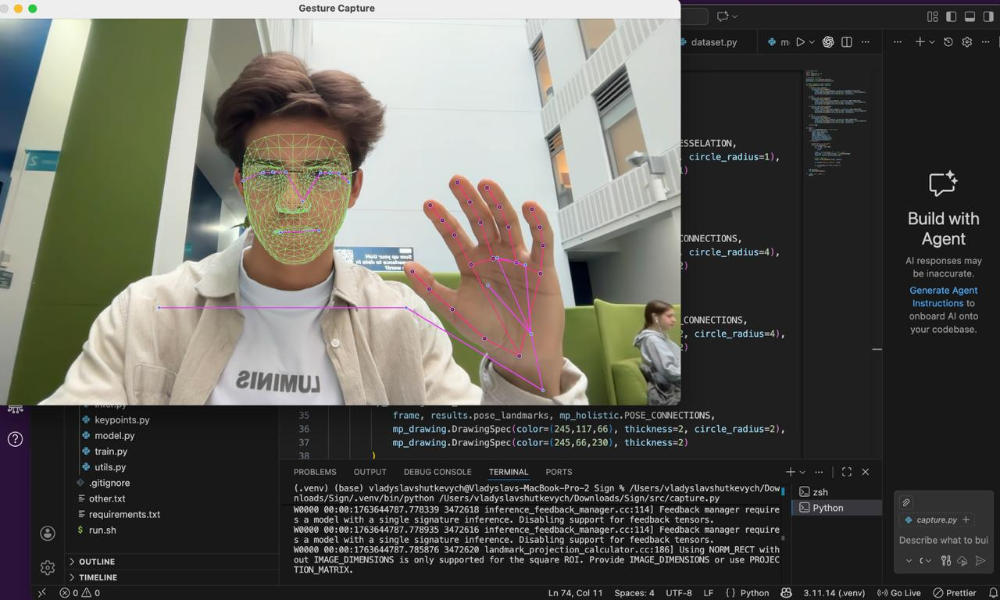
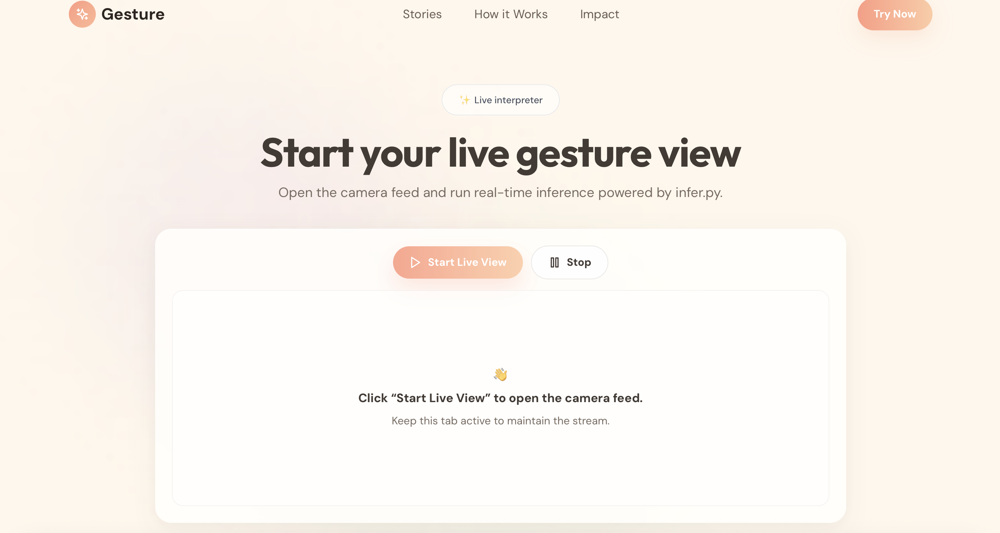
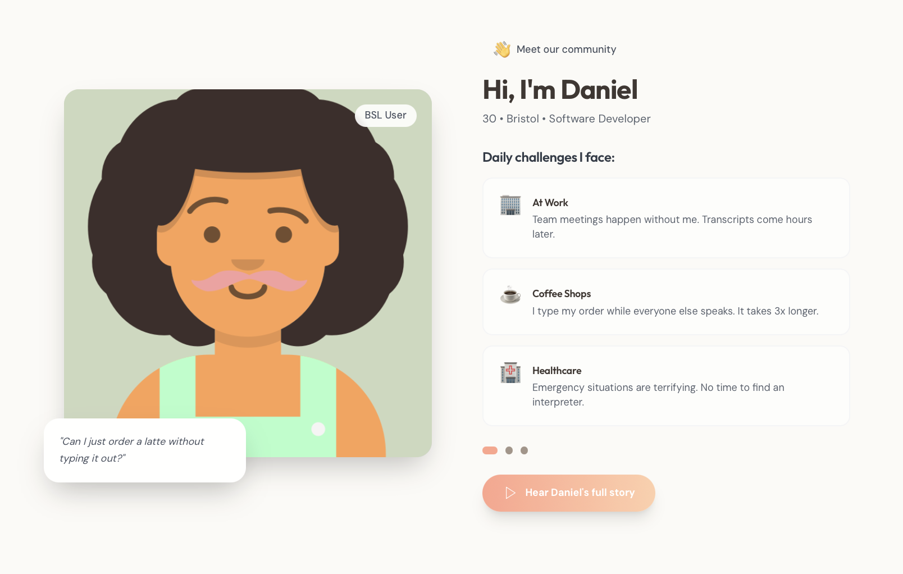
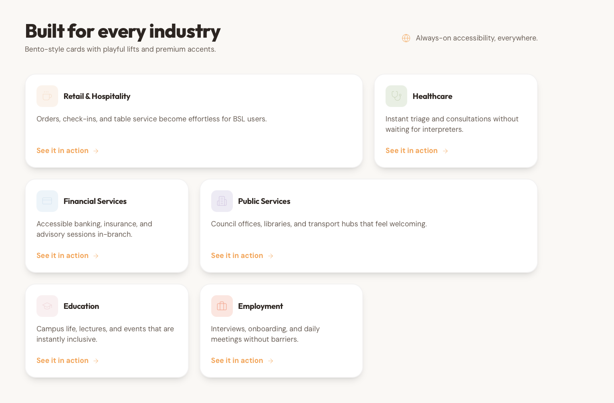

# British Sign Language Translator

> 🤟 Real-Time Computer Vision & Sequence Learning Project  
> ♿ Accessibility-Focused AI System for Gesture Understanding  

---

## 🚀 Overview

**British Sign Language Translator** is a real-time, AI-powered computer vision system that translates **British Sign Language (BSL) gestures into plain English text** using webcam input. The system captures human motion via MediaPipe, extracts spatiotemporal keypoints from hands, face, and upper body, and performs sequence-based gesture classification using a deep learning model trained on recorded sign sequences.

The project now ships with a **Flask streaming backend**, a **Vite/React frontend**, and an **ElevenLabs-powered voice layer** so gestures are captured, classified, displayed, and spoken through a single cohesive experience. Designed with **accessibility, low latency, and modularity** in mind, the stack runs locally, responds instantly, and helps bridge communication gaps between signers and non-signers.

---

## 💡 Core Features

### 🤲 Real-Time Gesture Recognition

- Live webcam capture using **OpenCV** with frame-by-frame landmark tracking.
- MediaPipe **Holistic** model tracks hands, face, and upper body simultaneously.
- Robust to natural motion variation and differences in signing speed.

### 🧠 Temporal Gesture Understanding

- Gestures represented as **time-based sequences of keypoints**, preserving motion dynamics.
- Fixed-length temporal windows enable consistent training and inference.
- Sliding window inference allows continuous recognition without manual segmentation.

### 🧮 Deep Learning Classifier

- **LSTM-based neural network** trained on sequential keypoint data.
- Learns temporal dependencies unique to each sign.
- Outputs probabilistic predictions mapped directly to plain-English labels.

### 🖥️ Instant Feedback Loop

- As soon as a gesture is recognized with sufficient confidence, it is printed to the terminal.
- Low-latency, on-device inference without reliance on cloud services.
- Designed for real-time experimentation and live demonstrations.

### ♿ Accessibility-Oriented Design

- Camera-only interaction — no gloves, trackers, or external sensors required.
- Runs fully locally for privacy, reliability, and offline use.
- Simple workflow for extending the vocabulary with new gestures.

### 🌐 Streaming Backend Services

- Serve the production Vite build and MJPEG assets directly from **Flask**, simplifying deployment.
- Stream the webcam feed as a multipart MJPEG response that includes landmark overlays and model output.
- Gate predictions through **deque-based buffers** so the stop action can instantly flush state and pause inference.

### 🎨 Immersive Frontend Experience

- Animate every section with **Framer Motion**, scroll-linked parallax, and magnetic stat cards built in React.
- Trigger live inference from the UI, which requests the streaming feed with a cache-busting timestamp and halts it through the stop control.
- Present the product story with Tailwind CSS, Lucide icons, and Bento-style layouts that emphasize accessibility metrics.

### 🔊 ElevenLabs Voice Output

- Convert confirmed gestures to speech through a background **ElevenLabs** worker that keeps the CV loop non-blocking.
- Enforce configurable cooldowns and gesture whitelists so announcements stay relevant and non-repetitive.
- Cache synthesized MP3 snippets, reuse them when gestures repeat, and auto-play them via lightweight system players or PyDub.

---

## 🏗️ System Architecture

Vite/React Frontend (Live MJPEG viewer + controls)  
→ Flask Streaming Backend (live stream + inference control)  
→ MediaPipe Holistic  
→ Keypoint Extraction (Hands + Pose, privacy-filtered face landmarks)  
→ Temporal Sequence Buffer  
→ LSTM Gesture Classifier  
→ Text Overlay + ElevenLabs Voice Output

- **Frontend:** Hosts the immersive UI, launches the live feed, and signals the backend to end a session.  
- **Flask Backend:** Boots the camera loop, streams MJPEG frames, and protects inference with stop events and buffers.  
- **MediaPipe Holistic:** Detects 3D landmarks for hands, face, and upper body.  
- **Keypoint Extraction:** Normalizes pose-relative coordinates, removes facial data, and flattens keypoints.  
- **Temporal Sequence Buffer:** Maintains recent frames to provide temporal context for classification.  
- **LSTM Gesture Classifier:** Learns motion patterns and predicts gestures.  
- **Voice + Text Output:** Displays recognized gestures in real time, then plays the ElevenLabs announcement.  

---

## 🏗️ Tech Stack

| Layer | Technologies |
|------|--------------|
| Frontend Experience | React 18, Vite, Tailwind CSS, Framer Motion, Lucide Icons |
| Streaming Backend & APIs | Flask, Werkzeug, threading.Event buffers, MJPEG streaming, Jinja templates |
| Computer Vision & Tracking | OpenCV, MediaPipe Holistic, custom keypoint extraction/visualization |
| Machine Learning | PyTorch, GestureLSTM (stacked LSTMs), TorchScript-ready export |
| Data Tooling | NumPy, Pandas, Scikit-learn, sliding-window dataset builders |
| Voice & Audio | ElevenLabs API, Requests, PyDub, afplay/ffplay/mpg123 fallbacks, cached MP3 playback |
| Runtime & Environment | Python 3.11, Virtualenv, CUDA-enabled GPU support, python-dotenv |
| Deployment & Distribution | Local/offline-first, Vite build artifacts, Flask app server, Docker-ready |
| Testing & Validation | PyTest, integration smoke tests, confusion-matrix evaluation & TensorBoard logging |

---

## 🛠️ Backend Services & APIs

- Serve the compiled Vite frontend, assets, and templates straight from the build output, so `Flask` doubles as both API and web host.
- Stream the MJPEG output, draw landmarks through the computer vision utility layer, and run inference inside a controllable generator loop.
- Expose a stop action that sets a `threading.Event`, clearing buffers and shutting down capture threads without restarting the server.
- Load Torch models once at boot, pin them to CUDA when available, and reuse prediction/prediction-stability buffers between requests.

## 🎨 Frontend Experience (Vite + React)

- Compose a single-page experience with Framer Motion, scroll-linked transforms, and magnetic stat cards.
- Launch and stop the live stream directly from the UI, swapping hero media for the MJPEG output on demand.
- Spotlight accessibility metrics, industries, and personas through Tailwind-powered layouts, Lucide icons, and animated gradients.
- Bundle everything with Vite for ultra-fast local development, then serve the optimized build via the backend.

## 🔊 ElevenLabs Voice Pipeline

- Configure API keys, model IDs, cooldowns, and gesture-to-text mappings via environment variables or a dedicated voice config module (dotenv supported).
- Enqueue gestures through `speak_gesture`, which drops duplicates within the repeat cooldown and keeps inference threads unblocked.
- Cache MP3 bytes with an `OrderedDict`, reuse clips for common signs, and fall back to PyDub if native players are missing.
- Guard against noisy inputs by allowing only whitelisted gestures to speak and by enforcing announcement cooldowns between calls.

---

## 🧠 Why This Project Stands Out

✅ End-to-end ML system covering **data capture, training, streaming, and real-time inference**  
✅ Sequence-based learning instead of static pose classification  
✅ Multi-landmark fusion using hands, face, and body keypoints  
✅ Accessibility-driven application with clear real-world relevance  
✅ Clean, modular architecture spanning **React frontend, Flask backend, and ElevenLabs voice**  

This project demonstrates proficiency in **computer vision pipelines**, **temporal deep learning models**, and **practical AI system design**.

---

## 🔮 Future Enhancements

- Compose sentence-level translations with automatic gesture segmentation.  
- Inject temporal attention or transformer blocks to boost classification accuracy.  
- Ship a lightweight WebRTC mode so remote browsers can subscribe to the live feed without MJPEG polling.  
- Deploy optimized models to edge devices (Jetson, iOS) for untethered experiences.  
- Personalize ElevenLabs voices per venue and expose UI controls for selecting tone and language.  

---

## 🎯 Example Use Case

1. User stands in front of a webcam.  
2. Performs a BSL gesture (e.g. *“yes”*).  
3. System captures motion across multiple frames.  
4. Flask streams frames to the React UI while the model classifies the gesture in real time.  
5. The recognized word is displayed instantly in English and queued for ElevenLabs playback.  
6. The voice layer announces the phrase so nearby listeners hear it immediately.

---

**British Sign Language Translator** demonstrates how modern computer vision and deep learning can be combined into a **real-time, accessible, and impactful AI application**, transforming human motion into language with speed, precision, and purpose.
