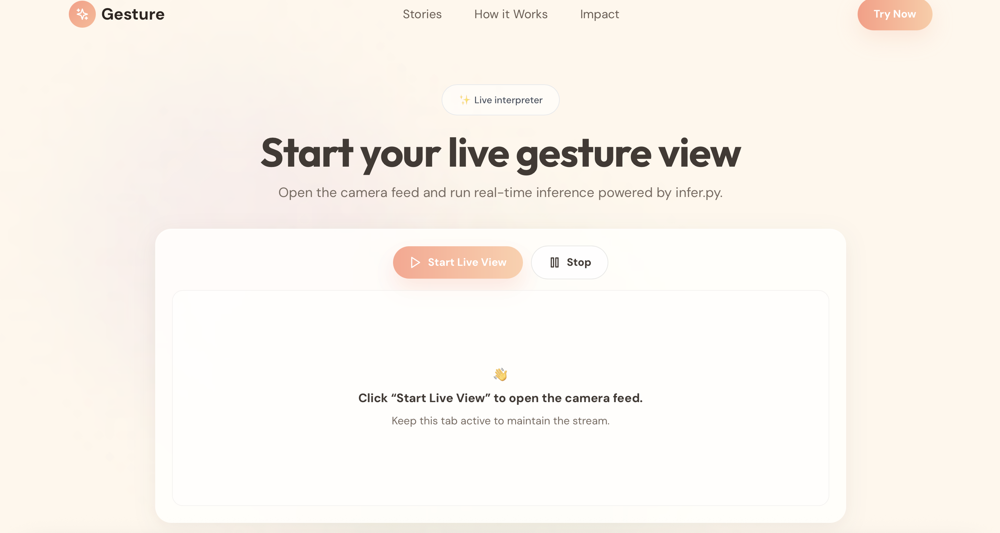

# British Sign Language Translator

> **🥇 1st Place at the Accelerate ME x Housr — Elevenlabs Challenge**  
> 🤟 Real-Time Computer Vision & Sequence Learning Project  
> ♿ Accessibility-Focused AI System for Gesture Understanding

---

## 🚀 Overview

**British Sign Language Translator** is a real-time, AI-powered system that translates **BSL gestures into English text and speech**. Using a webcam, the system captures human motion via MediaPipe, extracts spatiotemporal keypoints, and performs sequence-based classification using a deep learning model.

The project features a **Flask backend**, a **React frontend**, and an **ElevenLabs-powered voice layer**. Designed for accessibility and low latency, the system runs locally to bridge communication gaps between signers and non-signers instantly.

---

## 💡 Core Features

### 🤲 Real-Time Recognition & Tracking

- Live webcam capture using **OpenCV** with frame-by-frame landmark tracking.
- MediaPipe **Holistic** model tracks hands, face, and upper body simultaneously.
- Robust handling of natural motion variations and signing speeds.

### 🧠 Temporal Deep Learning

- **LSTM-based neural network** trained on sequential keypoint data to learn motion dynamics.
- Sliding window inference enables continuous recognition without manual segmentation.
- Probabilistic predictions mapped directly to English labels.

### 🌐 Streaming & Feedback

- **Flask Streaming Backend:** Delivers an MJPEG feed with landmark overlays and model output.
- **React Frontend:** High-performance UI built with Vite and animated via Framer Motion.
- **Low Latency:** On-device inference ensures privacy and instant feedback.

### 🔊 ElevenLabs Voice Integration

- **Speech Synthesis:** Confirmed gestures are converted to speech via ElevenLabs.
- **Smart Caching:** Reuses synthesized audio snippets to minimize API calls and latency.
- **Non-blocking Pipeline:** Background workers handle audio so the CV loop remains fluid.

---

## 🏗️ System Architecture

1. **React Frontend** (UI & Controls)
2. **Flask Backend** (Stream & Inference)
3. **MediaPipe Holistic** (Landmark Extraction)
4. **LSTM Classifier** (Temporal Pattern Recognition)
5. **ElevenLabs API** (Voice Output)

- **Frontend:** Interactive dashboard for live feed control and accessibility metrics.
- **Backend:** Manages the camera loop, MJPEG streaming, and inference state.
- **CV Layer:** Normalizes 3D coordinates and flattens keypoints for model consumption.
- **ML Layer:** Processes temporal sequences to predict gestures with high confidence.

---

## 🏗️ Tech Stack

| Layer | Technologies |
|------|--------------|
| Frontend | React, Vite, Tailwind CSS, Framer Motion, Lucide Icons |
| Backend | Flask, Werkzeug, MJPEG Streaming, Jinja |
| Computer Vision | OpenCV, MediaPipe Holistic |
| Machine Learning | PyTorch, LSTM, TorchScript, NumPy, Pandas, Scikit-learn |
| Voice & Audio | ElevenLabs API, PyDub, Requests |
| Runtime | Python, CUDA, Virtualenv, Docker, Dotenv |

---

## 🛠️ Backend & Voice Pipeline

- **API Integration:** Flask serves the optimized React build and handles live inference requests.
- **State Management:** Inference buffers are managed via internal events to allow instant pausing and flushing of the gesture state.
- **Audio Logic:** The voice module enforces configurable cooldowns and whitelists to ensure announcements stay relevant and non-repetitive.
- **Performance:** Torch models are pinned to CUDA when available for accelerated real-time prediction.

---

## 🧠 Why This Project Stands Out

✅ End-to-End ML: Covers data capture, training, streaming, and real-time inference.  
✅ Sequence Learning: Utilizes temporal motion patterns rather than static poses.  
✅ Multi-Landmark Fusion: Combines hands, face, and body data for higher accuracy.  
✅ Accessibility First: A camera-only solution requiring no expensive sensors or gloves.  

---

## 🎯 Example Use Case

1. **Capture:** User performs a BSL gesture (e.g., "Yes") in front of a webcam.  
2. **Process:** Flask streams the frames while the LSTM model analyzes the motion sequence.  
3. **Display:** The recognized word appears instantly on the React dashboard.  
4. **Speak:** ElevenLabs generates or plays the corresponding audio for immediate verbal communication.

