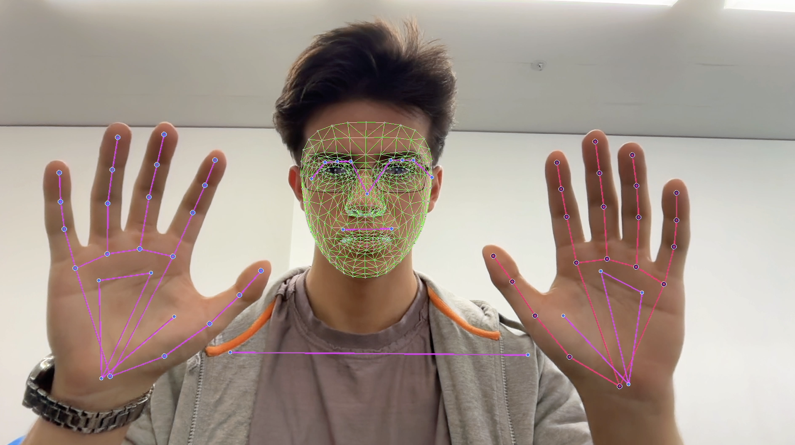

# British Sign Language Translator

**British Sign Language Translator** is an end-to-end accessibility system that converts BSL gestures into English text and spoken output in real time. The project combines computer vision, sequence modeling, API/backend engineering, and a production-ready frontend into one deployable pipeline.

> **🏆 1st Place, Accelerate ME x Housr - ElevenLabs Challenge**  
> - Real-time BSL translation platform built with Flask, React, MediaPipe, LSTM, OpenCV, and ElevenLabs.  
> - Designed and delivered as a deployable end-to-end system, not a tutorial prototype.



## Overview

This project addresses a practical communication gap between BSL users and non-signers in everyday interactions. A webcam stream is processed with MediaPipe landmarks, classified using a PyTorch LSTM model, and delivered through a Flask + React application with optional ElevenLabs voice synthesis.

The implementation is designed for low-latency local inference, clear system boundaries, and maintainable integration across ML, backend, and UI layers.

## Features

- Real-time gesture recognition from webcam input using OpenCV + MediaPipe Holistic.
- Temporal classification with an LSTM model trained on keypoint sequences.
- Confidence thresholding and stability voting to reduce false positives.
- Flask MJPEG streaming endpoint for live annotated video.
- React interface that controls start/stop inference and renders live stream output.
- ElevenLabs speech output with queueing, cooldown control, and cache-aware playback.

## Architecture

1. React frontend issues control actions and displays live stream output.
2. Flask backend manages stream lifecycle and exposes `/video_feed` and `/stop_infer`.
3. OpenCV captures frames; MediaPipe extracts face/body/hand landmarks.
4. Landmark sequences are buffered and passed into an LSTM classifier.
5. Stable predictions are mapped to labels and optionally spoken via ElevenLabs.

Data flow:

- Input: webcam frames.
- Intermediate representation: normalized keypoint vectors.
- Model output: class probabilities over gesture labels.
- User-facing output: text label + optional synthesized speech.

## Tech Stack

- Frontend: React, Vite, Tailwind CSS, Framer Motion.
- Backend: Flask, MJPEG streaming, Jinja template serving.
- Computer Vision: OpenCV, MediaPipe Holistic.
- Machine Learning: PyTorch, LSTM sequence model, NumPy, scikit-learn tooling.
- Voice: ElevenLabs API, requests, pydub fallback playback.
- Runtime: Python, virtualenv, optional CUDA acceleration.

## Code Highlights

### 1. Real-time inference loop with temporal stabilization

```python
# web_app.py
def _decode_prediction_metrics(logits):
	probs = torch.softmax(logits, dim=1)
	top_probs, top_idxs = torch.topk(probs, k=min(2, probs.size(1)), dim=1)
	confidence = top_probs[0, 0].item()
	pred_idx = top_idxs[0, 0].item()
	second_best = top_probs[0, 1].item() if probs.size(1) > 1 else 0.0
	margin = confidence - second_best
	entropy = -(probs * torch.log(probs.clamp_min(1e-8))).sum(dim=1).item()
	normalized_entropy = entropy / math.log(max(probs.size(1), 2))
	return pred_idx, confidence, margin, normalized_entropy


if len(frame_buffer) == WINDOW_SIZE:
	seq = torch.tensor([list(frame_buffer)], dtype=torch.float32).to(DEVICE)
	with torch.no_grad():
		logits = model(seq)
		pred_idx, conf, margin, norm_entropy = _decode_prediction_metrics(logits)

		if _should_accept_prediction(conf, margin, norm_entropy):
			prediction_buffer.append(pred_idx)
			most_common, count = Counter(prediction_buffer).most_common(1)[0]
			if count >= PREDICTION_STABILITY:
				gesture = idx_to_label[most_common]
				now = time.monotonic()
				can_emit = (
					gesture != last_confirmed_label
					or now - last_confirmed_at >= PREDICTION_COOLDOWN_SECONDS
				)
				if can_emit:
					speak_gesture(gesture)
					last_confirmed_at = now
					last_confirmed_label = gesture
				prediction_buffer.clear()
```

What it does:
- Computes confidence, top-2 class margin, and normalized entropy from model logits.
- Uses temporal voting and cooldown-based emission to avoid repeated, ambiguous outputs.

Why it matters:
- Adds production-quality safeguards around an LSTM classifier in a noisy webcam setting.
- Demonstrates strong ML engineering decisions beyond raw accuracy metrics.

Skills demonstrated:
- PyTorch inference analysis, uncertainty gating, low-latency stateful backend design.

### 2. Non-blocking ElevenLabs voice synthesis with rate control

```python
# src/tts_elevenlabs.py
def speak_gesture(gesture: str) -> bool:
	text = GESTURE_TO_TEXT.get(gesture)
	if not text:
		return False

	_start_worker_if_needed()

	now = time.monotonic()
	with _state_lock:
		if _last_spoken_at is not None:
			cooldown_elapsed = now - _last_spoken_at
			if cooldown_elapsed < ANNOUNCEMENT_COOLDOWN_SECONDS:
				return False
		if _last_enqueued_text == text and _last_enqueued_at is not None:
			if now - _last_enqueued_at < TTS_REPEAT_COOLDOWN_SECONDS:
				return False
		_clear_pending_queue()
	_tts_queue.put(text)
	return True


def _get_audio_bytes(text: str) -> bytes:
	with _state_lock:
		cached = _audio_cache.get(text)
		if cached is not None:
			_audio_cache.move_to_end(text)
			return cached

	audio_bytes = _fetch_tts_audio(text)
	with _state_lock:
		_audio_cache[text] = audio_bytes
		while len(_audio_cache) > max(TTS_CACHE_MAX_ITEMS, 0):
			_audio_cache.popitem(last=False)
	return audio_bytes
```

What it does:
- Applies queue throttling and cooldown controls before scheduling speech.
- Reuses synthesized clips via an LRU-style in-memory cache to reduce API calls.

Why it matters:
- Preserves real-time responsiveness under bursty gesture streams.
- Shows practical reliability and cost controls for third-party API integration.

Skills demonstrated:
- Concurrent systems programming, API robustness, latency-aware optimization.

### 3. Deployable Flask streaming and health endpoints

```python
# web_app.py
@app.route("/video_feed")
def video_feed():
	STOP_EVENT.clear()
	return Response(
		generate_frames(),
		mimetype="multipart/x-mixed-replace; boundary=frame",
	)


@app.route("/healthz")
def healthz():
	return jsonify(
		{
			"status": "ok",
			"device": str(DEVICE),
			"num_classes": len(idx_to_label),
			"window_size": WINDOW_SIZE,
		}
	)
```

What it does:
- Exposes a continuous MJPEG stream for real-time browser rendering.
- Adds an operational health endpoint with runtime metadata.

Why it matters:
- Demonstrates deployability concerns expected in production-grade services.
- Provides observability hooks for uptime checks and environment verification.

Skills demonstrated:
- Flask API engineering, streaming protocols, production readiness.

## Why It Stands Out

- End-to-end implementation: dataset handling, training, inference, backend APIs, and frontend UX.
- Production-oriented design choices: confidence thresholds, temporal smoothing, cooldown management, and stream control endpoints.
- Strong multi-disciplinary integration across Python, Flask, React, ML, and computer vision.
- Accessibility impact: camera-only setup with immediate text and speech feedback.

## Example Use Case

1. A user signs a gesture (for example, "yes") in front of a webcam at a reception desk.
2. The backend extracts landmarks, runs LSTM sequence inference, and verifies stability.
3. The recognized label is rendered in the web interface for both participants.
4. ElevenLabs synthesizes a natural-language spoken output to support fluid conversation.

